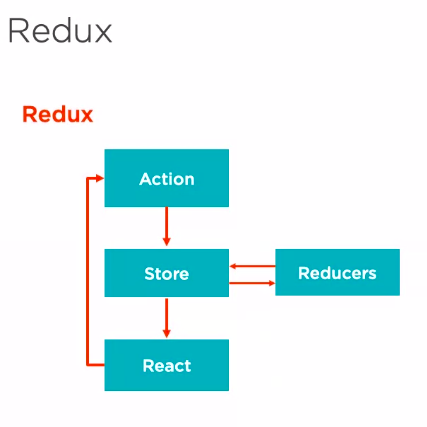

npm install

---

- webpack has become the most popular bundler. Use webpack to compile javascript to single minified file that works in browser.
- webpack also includes a development web server.
- babel transpiles all javascript features down so that they run in all browsers. Also it is needed as it needs to transpile JSX (which is not valid js).
- babel can be configured via .bablerc file, here we are using package.json though.
- "babel-preset-react-app" tells babel to transpile JSX and modern JS features like object spread, class properties, dynamic imports, and more to run in today's browsers.

### complete dev env:

- transpile: Babel
- bundle: Webpack
- lint: eslint
- webserver: webpack
- generating index.html: webpack
- loading changes on save: webpack
- one command via npm scripts!

---

### four ways to create react component

- createClass component
  <code>var HelloWorld = React.createClass({...});</code>
- JS class component
  <code>class HelloWorld extends React.Component {...}</code>
- function component
  <code> function HelloWorld(props){return(...)}</code>
- arror function
  <code>const HelloWorld = (props) => ... </code>

---

### note

only class components support state, refs, lifecycle methods before 16.8 but after v16.8 functional components support these using hooks.

---

### container(or smart/stateful/controller view) vs presentation(or dumb/stateless/view) components

container components: you can call them the backend for the front end, typically stateful, concerned with passing data, typically created using Redux's connect function at the bottom of the file

presentation components just rely on props, no dependence on rest of the app, such as actions or stores. They don't specify how the data is loaded or mutated.

| container                  | presentation                       |
| -------------------------- | ---------------------------------- |
| little or no markup        | nearly all markup                  |
| pass data and actions down | receive data and actions via props |
| knows about redux          | doesn't know about redux           |
| often stateful             | often no state                     |

---

## Redux

### Why need redux?

- Prop Drilling. lifting props all the way to parent component just to pass it down 2 separate components that need it. This results in many props existing in components just to pass data down.

- another way to solve this problem is to use React's context. Expose global data in functions from a given react component. To consume the data, you need to import the context into your component.

- The other option is Redux.

### Concept

- With redux there is a centralized store. Like a local, client side database. This is a single spot where app's global data is stored.
- Any component can connect to redux store.
- But redux store can't be connected to directly.
- Instead, a component has to dispatch an action. On dispatch the redux store is updated to reflect new data.
- Any connected components receive this new data from redux store and rerender.

### Core principles

- application state is palced in a single, immutable store
- only way to change a state is emit an action
- state changes are handled by pure functions

### Redux flow

- An Action describes a user's intent. It's an object with a type property and some data. 
- Actions are ultimately handled by reducers.
- A Reducer is a function that returns a new state based on the action passed. It receives the current state and returns the new state based on action.
- The store is updated whenever the reducer returns a new state.